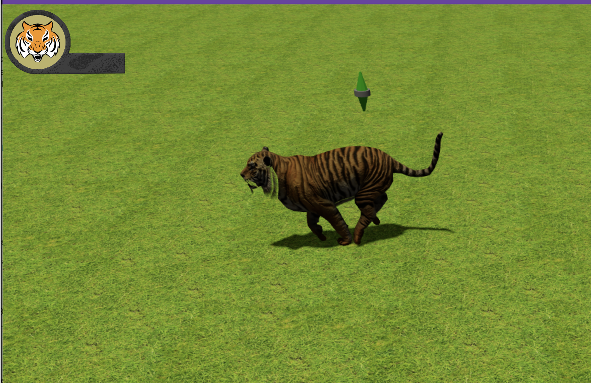

# JsGaming

Click on the tiger, then click somewhere on the ground. The tiger should move to that location.

# Screens




# How to start

Run the `server.py` and go to the address [localhost:8000](localhost:8000)

```sh
python3 server.py
```
